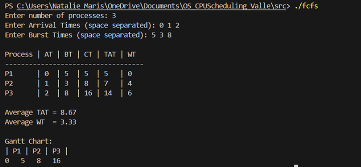
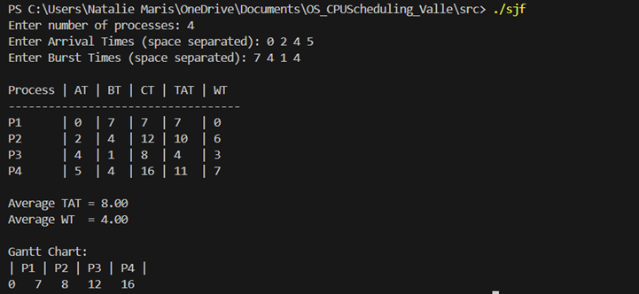
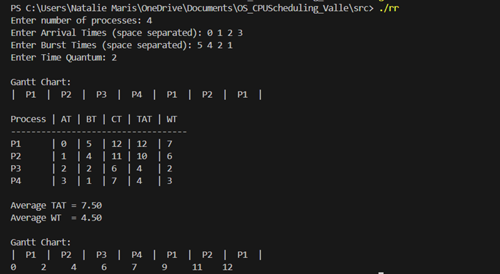

# CPU Scheduling Algorithms

This repository contains C implementations of three CPU Scheduling algorithms: **First Come First Serve (FCFS)**, **Shortest Job First (SJF)**, and **Round Robin (RR)**.  

---

## 📌 Algorithms Explained

### 1. First Come First Serve (FCFS) 
- Processes are executed in the order they arrive (arrival time).  
- The first process that comes in is the first to execute.  
- **Scheduling Criteria:** Arrival Time  

---

### 2. Shortest Job First (SJF)
- The process with the **shortest burst time** is executed first.  
- Minimizes average waiting time but requires knowledge of burst times.  
- **Scheduling Criteria:** Burst Time  

---

### 3. Round Robin (RR) 
- Each process is given a fixed **time quantum**.  
- Processes are executed in a cyclic order until all finish.  
- Good for **time-sharing systems**.  
- **Scheduling Criteria:** Time Quantum  

---

## 📂 Source Code
- `fcfs.c` – Implementation of First Come First Serve  
- `sjf.c` – Implementation of Shortest Job First  
- `rr.c` – Implementation of Round Robin  

---

## 🖼 Sample Input/Output Screenshots

### 🔹 FCFS
**Input/Output with Gantt Chart:**  
  

---

### 🔹 SJF
**Input/Output with Gantt Chart:**  
  

---

### 🔹 Round Robin
**Input/Output with Gantt Chart:**  
  

